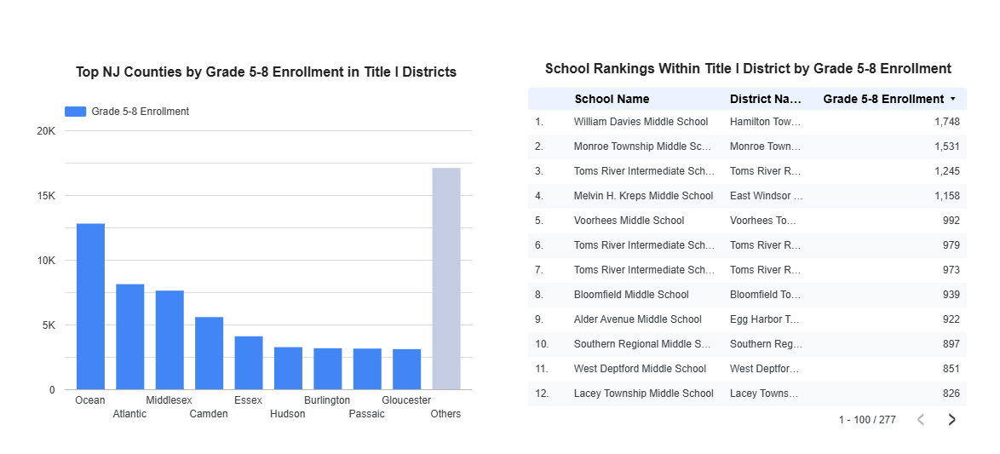

# NJ Title I Enrollment Analysis

## Overview
This project analyzes New Jersey Title I district enrollment data for grades 5–8 using SQL and Looker Studio.

## Tools Used
- MySQL
- Google Looker Studio
- Excel / CSV data cleaning

## Objectives
1. Rank NJ counties by total grade 5–8 enrollment in Title I districts.
2. Rank schools within each Title I district by grade 5–8 enrollment.

## Data Sources
- NJ public school enrollment data
- Title I allocation data

## Process
- Extracted and cleaned enrollment and Title I datasets
- Imported datasets into MySQL
- Used SQL joins, aggregation, filtering, and grouping
- Created visualizations in Looker Studio

## Dashboard



## Example Queries
```sql
SELECT
    e.`County Name`,
    SUM(e.`Fifth Grade` + e.`Sixth Grade` + e.`Seventh Grade` + e.`Eighth Grade`) AS middle_school_sum
FROM enrollments AS e
JOIN title1_allocations AS t
    ON UPPER(TRIM(REPLACE(e.`District Name`, ' School District', ''))) = UPPER(TRIM(t.District))
WHERE t.funds > 0
GROUP BY e.`County Name`
ORDER BY middle_school_sum DESC;
